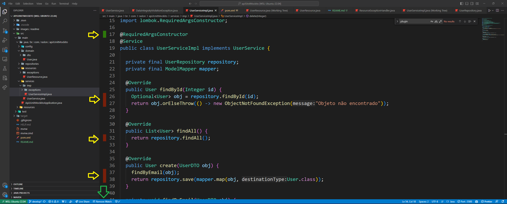

# Testes com JUnit 5 Mockito e Spring Boot (REST APIs)

Projeto de estudo de JUnit 5 com Mockito sobre o Spring Boot.
Você vai encontrar uma pequena API REST para cadastro de usuários que serve de base para a implementação de testes unitários.

## 🚀 Começando

Essas instruções permitirão que você obtenha uma cópia do projeto em operação na sua máquina local para fins de desenvolvimento e teste.

### 📋 Pré-requisitos

De que coisas você precisa para rodar a aplicação e ter total imersão nos conhecimentos que aqui se deseja explorar?

Java 11 - É interessante instalar via [SDKMAN](https://sdkman.io/)

VS Code - Editor de Código que permite adicionar extensões, inclusive para testes.

Extension Pack for Java - Extensão do VS Code que ajudar em projetos Java.

Coverage Gutters (semasquare) - Extensão do VS Code que permite visualizar a cobertura de teste do código.

## ⚙️ Executando os testes

```
./mvnw clean test
```

## 👁️‍🗨️ Visualizando a cobertura de testes

```
./mvnw jacoco:report
```

Após rodar o comando acima no terminal você deverá ativar a visualização da cobertura de teste. Para isso, clique na indicação da sete verde, conforme imagem abaixo, que vai estar somente com o texto `Watch`. Após ativado o texto estará como na imagem `Remove Watch`, significando que a visualização da cobertura de teste está ativo.

Assim como nas setas amarelas será possível ver no seu código o que tem (verde) ou não (vermelho) cobertura de teste.



## 📌 Versão

Nós usamos [SemVer](http://semver.org/) para controle de versão. Para as versões disponíveis, observe as [tags neste repositório](https://github.com/halyssonfreitas/u-junit-mockito/tags). 

## ✒️ Autores

Mencione todos aqueles que ajudaram a levantar o projeto desde o seu início

* **Halysson Freitas** - *Desenvolvimento da aplicação, teste e documentação*
  * [LinkedIn](https://www.linkedin.com/in/halysson-freitas/)
  * [GitHub](https://github.com/linkParaPerfil)

## 📄 Licença

Este projeto está sob a licença GNU General Public License (GPL) - veja o site [GNU General Public License (GPL)](https://www.gnu.org/licenses/gpl-3.0.en.html) para detalhes.
